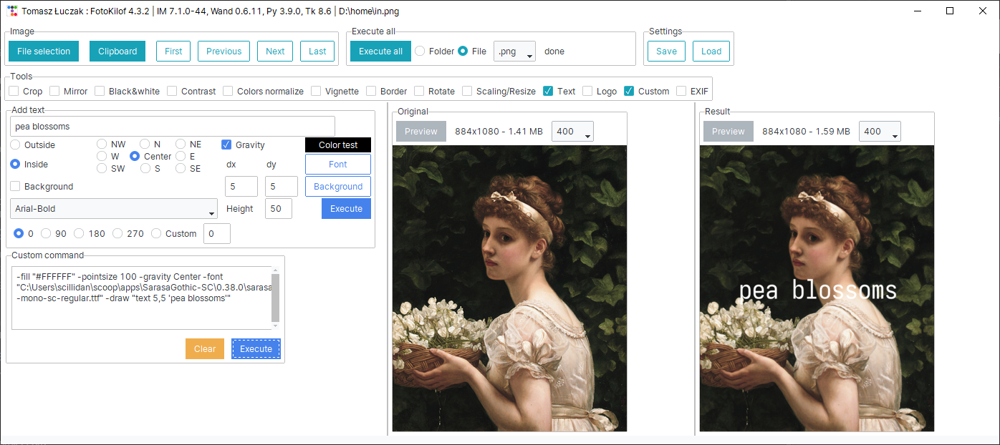
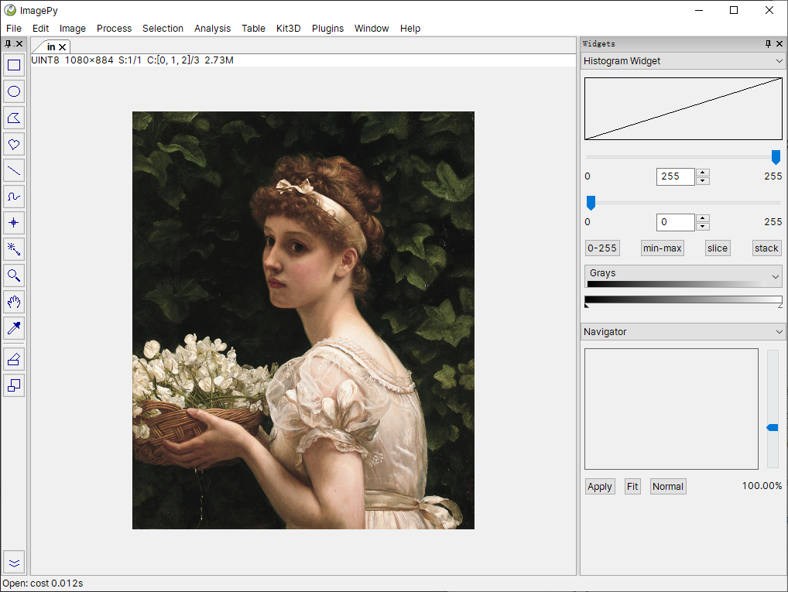

| source | license | tested | readme | preview |
|---|---|---|---|---|
| [chaiNNer](//github.com/chaiNNer-org/chaiNNer) |  |  | [.md](_readme/chainner.md) |  |
| [FotoKilof](//github.com/TeaM-TL/FotoKilof) |  |  | [.md](_readme/fotokilof.md) |  |
| [imagepy](//github.com/Image-Pyimagepy/imagepy) |  |  | [.md](_readme/imagepy.md) |  |