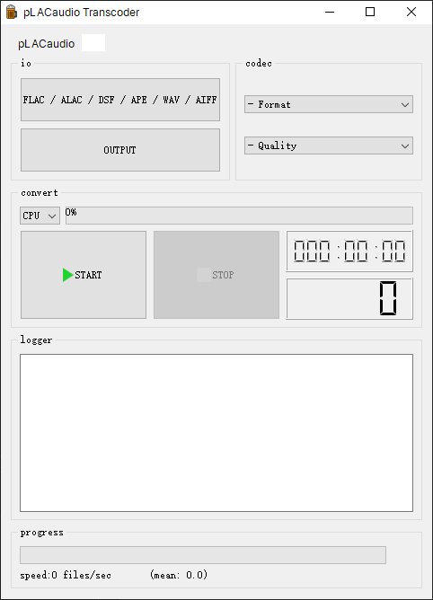
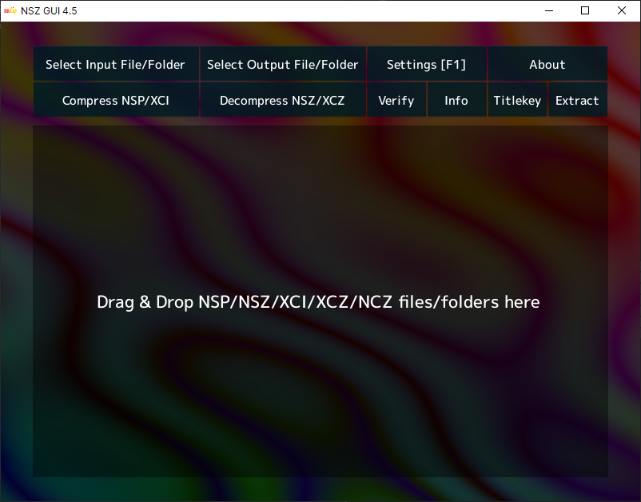

| source | license | tested | readme | preview |
|---|---|---|---|---|
| [PySimpleGUI-Base64-Encoder](//github.com/PySimpleGUI/PySimpleGUI-Base64-Encoder) |  |  | [.md](_readme/pysimplegui-base64-encoder.md) |  |
| [MKV Muxing Batch GUI](//github.com/yaser01/mkv-muxing-batch-gui) |  |  | [.md](_readme/mkv-muxing-batch-gui.md) |  |
| [pLACaudio](//github.com/fzao/pLACaudio) |  |  | [.md](_readme/placaudio.md) |  |
| [NSZ](//github.com/nicoboss/nsz) |  |  | [.md](_readme/nsz.md) |  |
| [chaiNNer](//github.com/chaiNNer-org/chaiNNer) |  |  | [.md](_readme/chainner.md) |  |
| [FotoKilof](//github.com/TeaM-TL/FotoKilof) |  |  | [.md](_readme/fotokilof.md) |  |
| [imagepy](//github.com/Image-Pyimagepy/imagepy) |  |  | [.md](_readme/imagepy.md) |  |